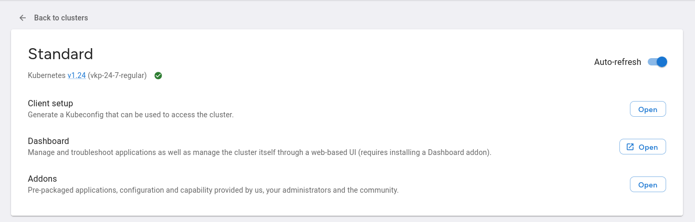

# Installing addons

## Via the Addon marketplace

Select the Cluster you wish to install addons into and click the "Open" button next to the "Addons" text:



Click the "Install" button next to an addon of your choosing:


It may take a few moments for the addon to completely install, though this will depend on what the addon is.
Small addons such as configuration will be significantly faster than full applications.

## Manually

Get a list of the addons available:

```bash
kubectl get clusteraddons -n my-namespace
```

Create a `ClusterAddonBinding`:

```yaml
apiVersion: paas.dcas.dev/v1alpha1
kind: ClusterAddonBinding
metadata:
  name: my-cluster-my-addon # (3)!
  namespace: my-namespace
spec:
  clusterAddonRef:
    name: my-addon # (1)!
  clusterRef:
    name: my-cluster # (2)!
```

1. This is the name of the addon we want to install.
2. This is the name of the cluster we want to install the addon into.
3. When installed via the Addon Marketplace, `ClusterAddonBinding` resources use the `clustername-addonname` format. To avoid causing issues, you should use the same naming scheme.
