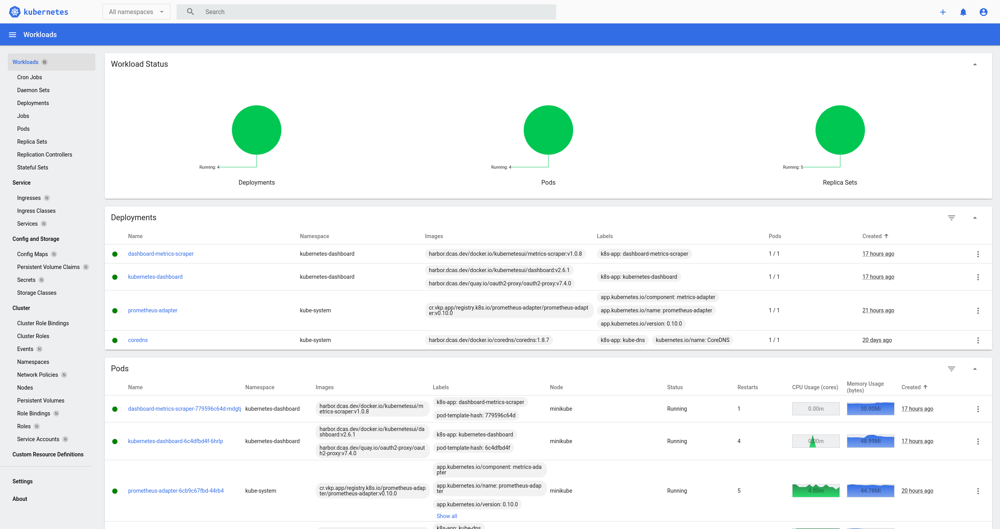

# Enabling a Dashboard

VKP supports 2 dashboards out-of-the-box.

!!! warning
    Only one dashboard should be installed at a time.

## Kubernetes Dashboard

> Dashboard is a web-based Kubernetes user interface. You can use Dashboard to deploy containerized applications to a Kubernetes cluster, troubleshoot your containerized application, and manage the cluster resources. You can use Dashboard to get an overview of applications running on your cluster, as well as for creating or modifying individual Kubernetes resources (such as Deployments, Jobs, DaemonSets, etc). For example, you can scale a Deployment, initiate a rolling update, restart a pod or deploy new applications using a deploy wizard.
> Dashboard also provides information on the state of Kubernetes resources in your cluster and on any errors that may have occurred.

https://kubernetes.io/docs/tasks/access-application-cluster/web-ui-dashboard/

The Kubernetes Dashboard can be installed via the Addon Marketplace.

## OpenShift Console

> The OpenShift Container Platform web console is a user interface accessible from a web browser. Developers can use the web console to visualize, browse, and manage the contents of projects.

!!! note
    The OpenShift Console is designed for OpenShift so a number of OpenShift-specific features will not work.
    Examples include Routes, DeploymentConfigs and Projects.

The OpenShift Console can be installed via the Addon Marketplace.
