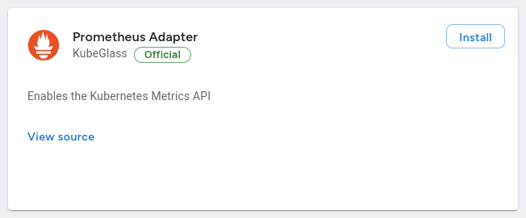

# Enabling Metrics

!!! warning
	The VKP does not currently return Node metrics since that would leak information about the management cluster that is not relevant to an individual tenant.

Kubernetes provides the [Resource Metrics API](https://kubernetes.io/docs/tasks/debug/debug-cluster/resource-metrics-pipeline/) to provide basic metric such as CPU and memory usage.
These metrics are useful to understand how many resources your workloads are consuming, but also to inform scaling decisions such as the [Horizontal Pod Autoscaler](https://kubernetes.io/docs/tasks/run-application/horizontal-pod-autoscale/).

Generally the Metrics API requires the installation of a highly-privileged component such as the [Metrics Server](https://github.com/kubernetes-sigs/metrics-server) or [Prometheus Adapter](https://github.com/kubernetes-sigs/prometheus-adapter).

The VKP simplifies this by providing a pre-configured deployment of the Prometheus Adapter that hooks into the Prometheus stack running on the management cluster.

To ensure that tenants aren't able to view metrics outside their tenancy, the VKP uses a component called the `metrics-proxy` which rewrites incoming queries to enforce expected access controls.

## Getting started

Head over to the Addon marketplace and install the "Prometheus Adapter" addon:

After a few minutes, you will notice that metrics start appearing in the Kubernetes Dashboard and via the `kubectl top pods` command.

!!! note
	The OpenShift Console does not use the Metrics API and will not show any metrics.
