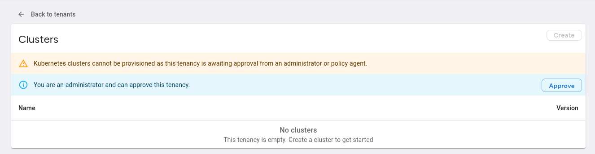

# Creating a Tenant

Open the VKP home page and click the "Create" button.

Enter the name of your tenancy:

!!! info
	The tenancy must follow the standard Kubernetes [resource naming restrictions](https://kubernetes.io/docs/concepts/overview/working-with-objects/names/#names).

Once created, the tenancy will enter the `PendingApproval` state.

You will need to wait for a VKP administrator to approve the tenancy.

Once approved, you will be able to create clusters inside this tenancy.
